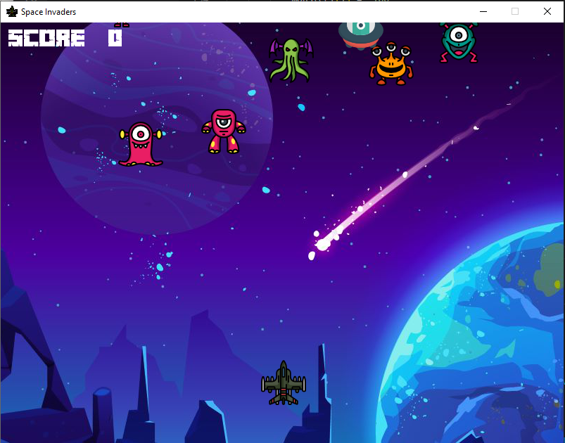

<h1>Python Hackathon</h1>
<h2>Space Invaders Game</h2>

Idea behind this game: I want to explore the pygame module so I decided to create a 1980-like style 2D shooting game. In addition, nowadays, people like me are busy and sometimes I just need 5-10 minutes to temporarily get away from school, work and other things. Thus, I create this simple game to help people relaxed for a moment and this game can be finished in a short period of time.

Improvement: I could have implemented audio/sound effect to make the game more interested. Also, I would put a Start button on the screen and so whenever people are ready to play the game, they can press the start button and play the game. In addition, I should put more monsters in this game to make the game a bit harder and challenged.

Business Opportunity: This game can be a mobile app that everyone can play it at anytime and anywhere.

<h4>Source code is referenced from: https://github.com/attreyabhatt/Space-Invaders-Pygame/commits?author=attreyabhatt</h4>

<a href="https://wei06159git.github.io/WeiShan-Portfolio/">😀Go Back to "About Me" page</a>
